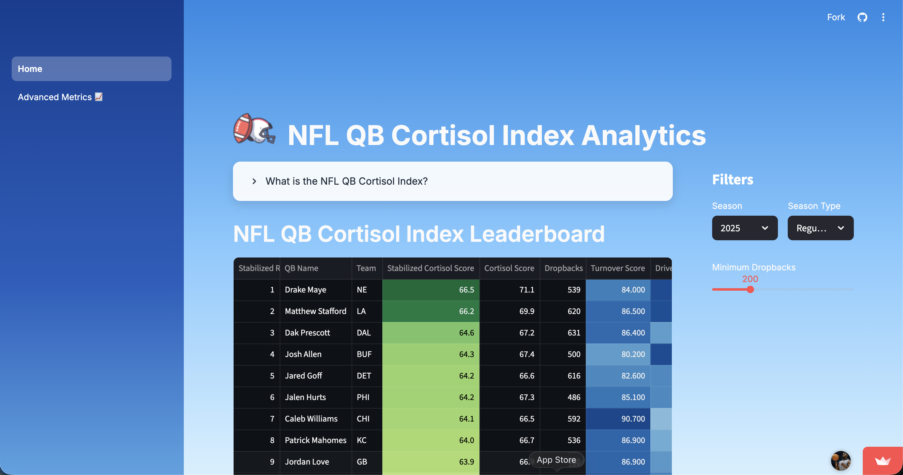
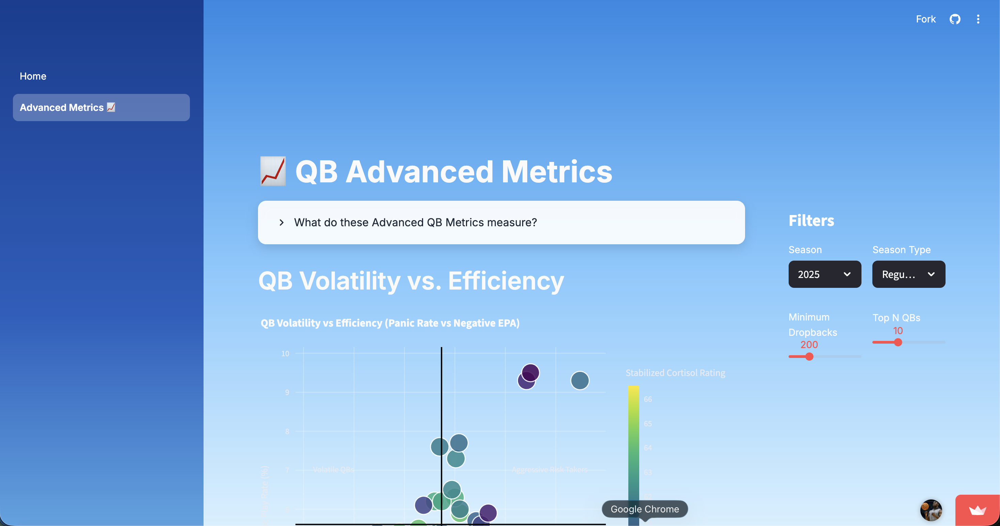

# NFL QB Cortisol Index: Evaluating Quarterback Stability Using NFL Data

## Introduction
This project is an end-to-end sports analytics platform that ranks NFL quarterbacks using a custom QB Cortisol Index, designed to measure offensive stability and stress-inducing mistakes. The index is built using engineered metrics derived from NFL player statistics and play-by-play data across the last five seasons. The analysis and dashboard were developed using Python, Pandas, Plotly, Altair, and Streamlit, with the project hosted on GitHub.

[](https://advait-patil-nfl-qb-cortisol-analytics.streamlit.app/)

## Cortisol Index Methodology

The **QB Cortisol Index** is designed to measure how consistently a quarterback keeps an offense productive while minimizing stress-inducing plays such as turnovers or drive-killing mistakes.

The index is calculated using normalized performance metrics grouped into three key categories.

### Drive Sustainability
Measures how effectively a quarterback keeps offensive drives alive.

- First Down Rate
- Completion Percentage

### Turnover Risk
Captures plays that typically increase fan stress and negatively impact offensive momentum.

- Interception Rate
- Fumble Lost Rate
- Sack Rate

### Offensive Success
Measures overall offensive productivity and efficiency.

- EPA per Dropback
- Yards per Attempt
- Touchdown Rate

All metrics are **normalized and inverted when necessary** so that higher values represent more stable quarterback performance.  
The final Cortisol Index score combines these metrics into a composite score used to rank quarterbacks across the last five NFL seasons.

## Dashboard Preview


## Technologies Used
1. Programming Language
   - Python
3. Data Processing
   - Pandas
4. Visualization Libraries
   - Altair
   - Plotly
5. Version Control
   - GitHub
6. Dashboard
   - Streamlit
   - Streamlit Community Cloud

## Data Source
nflreadpy is a Python library that provides easy access to NFL play-by-play and player statistics data from the nflverse data repository for analysis and modeling.

### More Info about nflreadpy
1. Installation Details - https://www.piwheels.org/project/nflreadpy/
2. Official Documentation - https://nflreadr.nflverse.com/index.html

## Data Pipeline
1. [Extract NFL Player Data](scripts/extract_data.py)
2. [Aggregate Data and Compute QB Metrics](scripts/build_qb_metrics.py)
3. [Calculate QB Cortisol Scores](scripts/cortisol_calculation.py)
4. [Extract Play-By-Play Data and Compute Advanced Metrics](scripts/build_advanced_metrics.py)
5. [Run Data Pipeline and build Master CSV](scripts/run_pipeline.py)

# Running the NFL QB Cortisol Index Project Locally

This guide explains how to run the full NFL QB Cortisol Index pipeline locally, including generating the master dataset and launching the Streamlit dashboard.

---

# 1. Clone the Repository

Clone the GitHub repository and navigate into the project directory.

```bash
git clone https://github.com/YOUR_USERNAME/nfl-qb-cortisol-analytics.git
cd nfl-qb-cortisol-analytics
```
# 2. Create A Python Virtual Environment (Recommended)

Creating a virtual environment helps isolate project dependencies.

```bash
python -m venv venv
```

Activate the environment

Mac/Linux:

```bash
source venv/bin/activate
```

Windows:

```bash
venv/scripts/activate
```

# 3. Install Required Dependencies

You can install all dependencies with:

```bash
pip install -r requirements.txt
```

# 4. Verify Project Directory Structure

Your project should contain folders similar to the following:

```
project-root/
│
├── scripts/
│   ├── extract_data.py
│   ├── build_qb_metrics.py
│   ├── cortisol_calculation.py
│   ├── build_advanced_metrics.py
│   └── run_pipeline.py
│
├── data/
│
├── images/
│
├── app.py
└── README.md
```

The scripts folder contains the data pipeline used to generate the master dataset.

# 5. Run the Data Pipeline

The project includes a modular Python pipeline that extracts NFL data and generates the final dataset used by the dashboard.

Run the pipeline script:

```bash
python scripts/run_pipeline.py
```

This script performs the following steps:

1. Extract NFL player statistics using nflreadpy

2. Extract play-by-play data

3. Engineer QB performance metrics

4. Compute advanced metrics

5. Calculate QB Cortisol scores

6. Export the final master dataset CSV

The final dataset will typically be saved in the data/processed/ directory.

# 6. Verify the Master Dataset

After the pipeline completes, confirm that the master dataset has been generated.

Example:
```bash
data/processed/qb_master.csv
```

# 7. Launch the Streamlit Dashboard

Once the dataset is generated, run the Streamlit application.

```bash
streamlit run app/Home.py
```

Streamlit will start a local server and open the dashboard automatically in your browser.

If it does not open automatically, navigate to:

```bash
http://localhost:8501
```

# 8. Using the Dashboard

The dashboard allows users to explore the QB Cortisol Index across multiple seasons.

Features include:

- QB Cortisol Index rankings

- Advanced QB performance metrics

- Interactive filters for season selection

- Data visualizations built with Plotly and Altair

# 9. (Optional) Rebuild the Dataset

If you want to refresh the dataset using updated nflverse data, simply rerun:

```bash
python scripts/run_pipeline.py
```

10. Troubleshooting

If you encounter dependency issues, try reinstalling the following packages:

```bash
pip install --upgrade pandas plotly altair streamlit nflreadpy
```

# Summary

To run the project locally:

1. Clone the repository

2. Create a virtual environment

3. Install dependencies

4. Run the data pipeline

5. Launch the Streamlit dashboard

This will generate the QB Cortisol dataset and allow you to explore the analytics dashboard locally.
